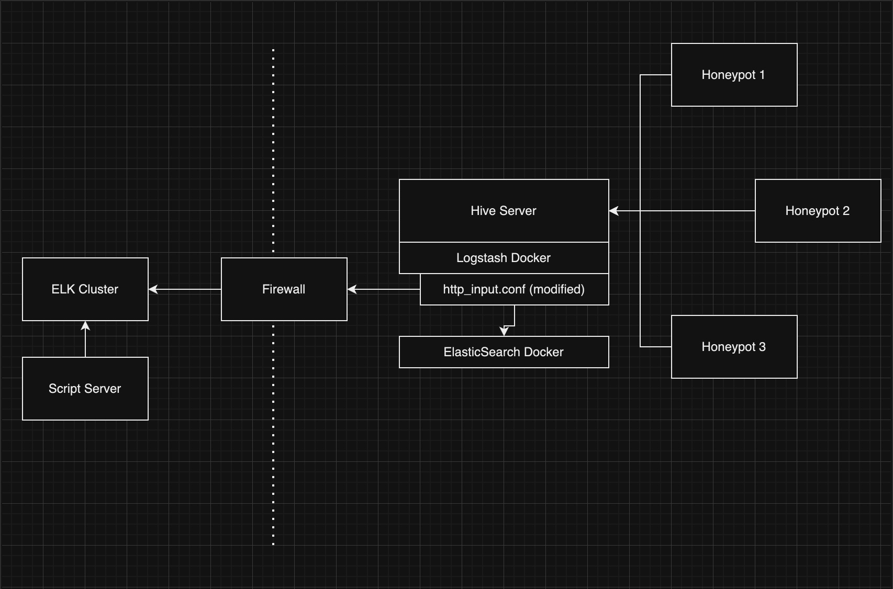

# TSEC TPOT Tools: 

- tsec Tpot Project: https://github.com/telekom-security/tpotce

- This is just a page of basic python scripts and tools i've created to help
with the amazing tsec tpot honeypot open source project

- let me first say... there has to be a better way to do what i'm doing.. 
but for now this works. I'd like to pull the info from the tsec tpot hive elasticsearch docker container via python and manipulate it.. and send it places..
- the reason i'm not pulling directly from the docker container is i havent found a good way to open that docker container in a secure way where only i had access. There is probably a way to mess with the bind firewall.. but i'm not familiar enough with it. 
- so my terrible approach is to mirror the data being saved on the honeypot to another elk cluster, that is secure but allows me to manipulate it.

More information on forwarding the honeypot info to another source:
- https://github.com/telekom-security/tpotce/wiki/Reconfigure-logstash.conf

one thing not mentioned in those instructions.
- stand alone honeypot install: modify logstash.conf like the wiki says
- hive/server install: follow the instructions but modify http_input.conf instead of logstash.conf

## What's here:
- **example_http_input_file** : **http_input.conf** : example http_input.conf modified to send data to another elk server
- **example_tpot_yml_file** : **tpot.yml** : example tpot.conf modified to use the modified/local http_input.conf
- **queryES** : **esWithPaging.py** : example python code to query elasticsearch for a time period. data is returned in a python list. 